# Application de Gestion d'E-commerce

Ce projet est une application de gestion d'e-commerce développée dans le cadre d'un projet académique. Elle propose des fonctionnalités pour les utilisateurs, les vendeurs et les administrateurs, avec une interface intuitive et des fonctionnalités robustes.

---

## Auteurs

- **Nouhaila AIT BELLA**
- **Chaimae RAZIK**

### Encadré par

- **Monsieur Hugo Sarazin**

---

## Diagrammes UML

### Diagramme de Cas d'Utilisation

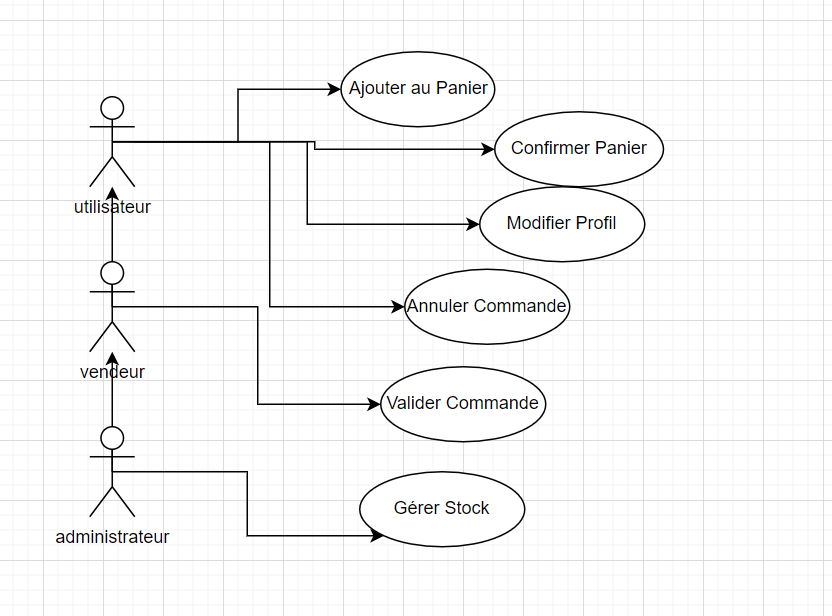

---

### Diagramme de Classe

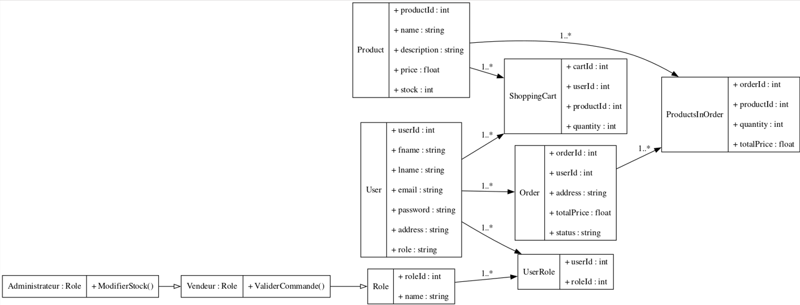

---

## Fonctionnalités de l'application

### 1. **Gestion du Panier**

- **Création d'un compte utilisateur** :
  Un utilisateur peut s'inscrire sur la plateforme via une interface simple et intuitive.
  - 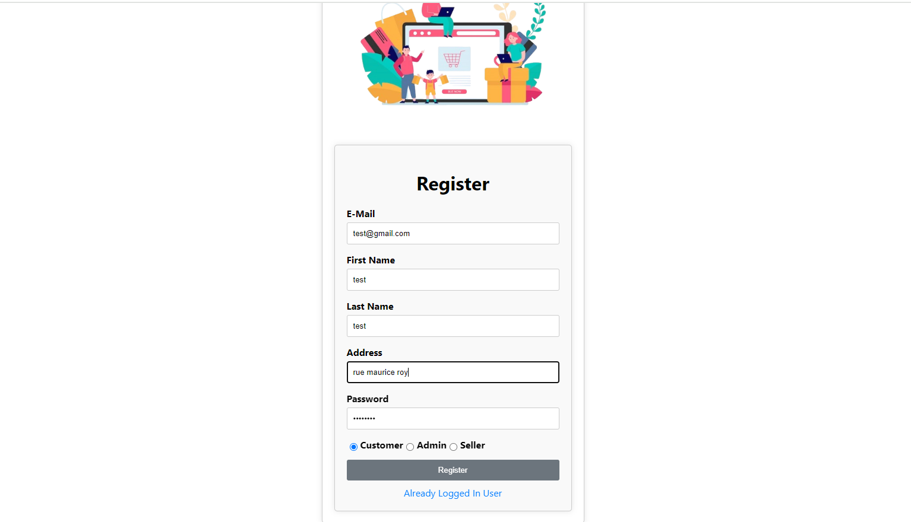

- **Connexion avec un utilisateur** :
  Après l'inscription, l'utilisateur peut se connecter à l'application.
  - 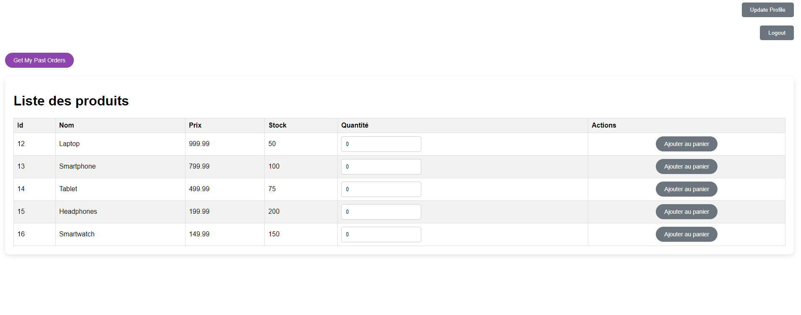

- **Ajout de produits au panier** :
  Les utilisateurs peuvent ajouter des produits à leur panier. Si le stock d'un produit est insuffisant, un message s'affiche pour informer l'utilisateur.
  - 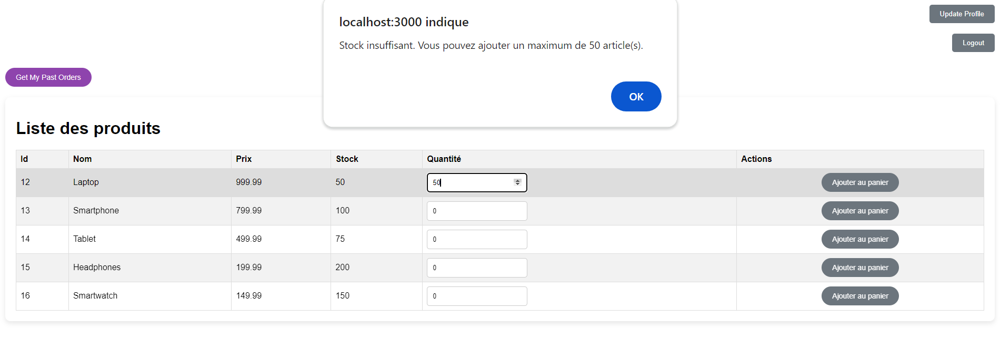
  - 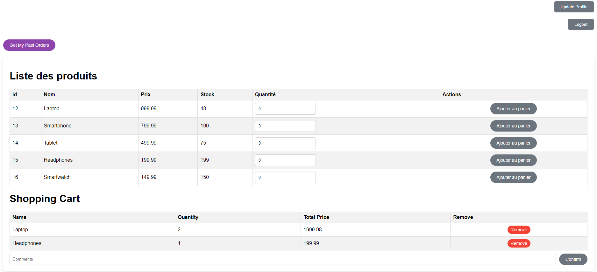

- **Confirmation des commandes** :
  Une fois les produits ajoutés au panier, l'utilisateur peut confirmer sa commande. Celle-ci sera mise en attente de validation par un vendeur ou un administrateur.
  - 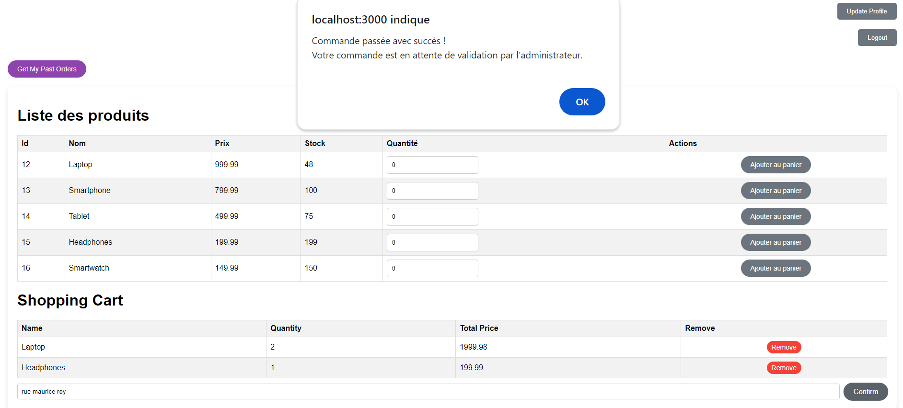

- **Visualisation des commandes passées** :
  Les utilisateurs peuvent accéder à leurs anciennes commandes depuis l'interface utilisateur.
  - 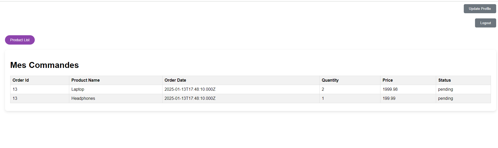

---

### 2. **Modification du Profil Utilisateur**

Les utilisateurs peuvent mettre à jour leurs informations personnelles, notamment :
- Nom,
- Adresse postale,
- Mot de passe.

Ces modifications peuvent être effectuées via une interface dédiée :
- 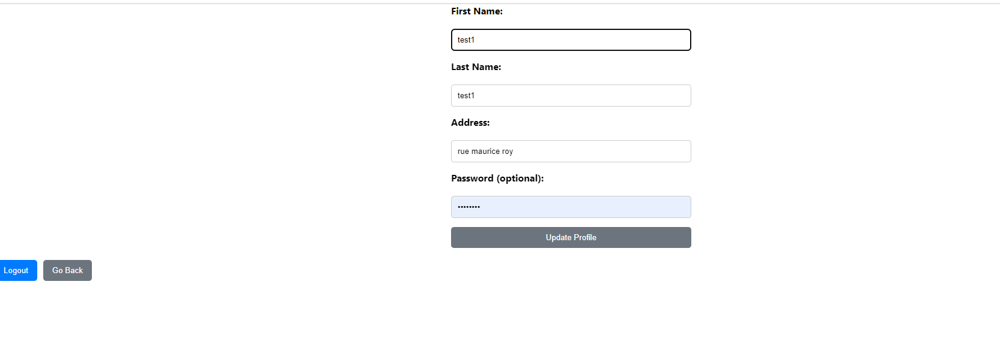
- 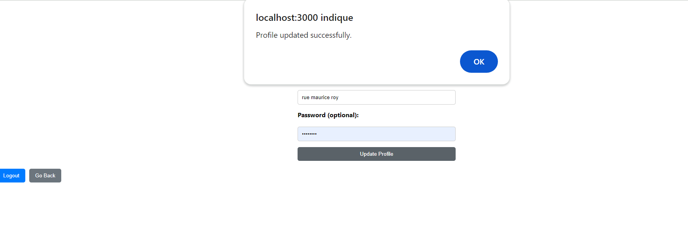

---

### 3. **Validation des Commandes (Vendeur)**

- **Création d'un compte vendeur et connexion** :
  Les vendeurs disposent de privilèges pour valider les commandes. Ils peuvent se connecter à une interface dédiée après avoir été créés comme vendeur.
  - 
  - 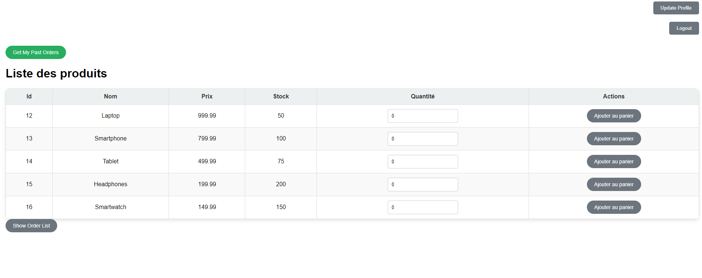

- **Validation des commandes** :
  Le vendeur peut accéder aux commandes en attente et les valider.
  - 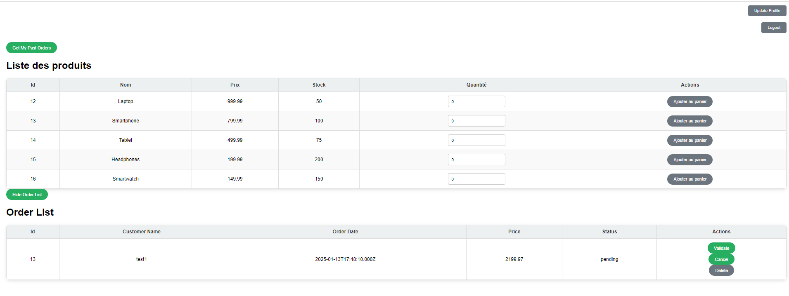
  - 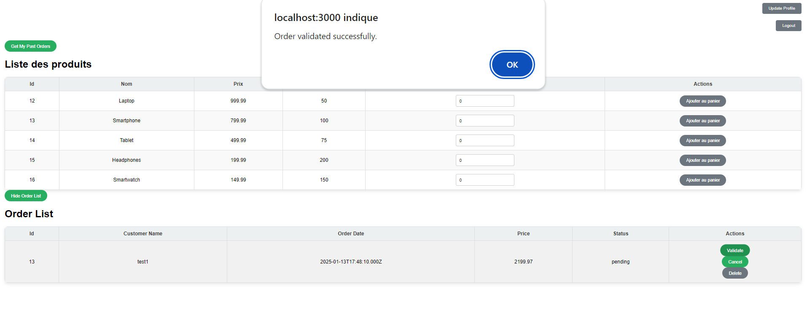
  - 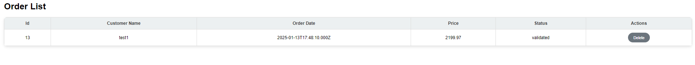

- **Ajout de produits au panier par le vendeur** :
  Les vendeurs peuvent également ajouter des produits à leur propre panier.

---

### 4. **Gestion des Stocks (Administrateur)**

- **Connexion en tant qu'administrateur** :
  L'administrateur dispose de tous les privilèges, y compris ceux des vendeurs.
  - 

- **Interface administrateur** :
  L'interface administrateur permet d'accéder à toutes les fonctionnalités de gestion.
  - 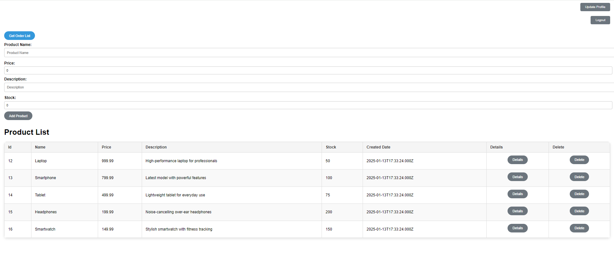

- **Visualisation et validation des commandes** :
  L'administrateur peut voir toutes les commandes et les valider.
  - 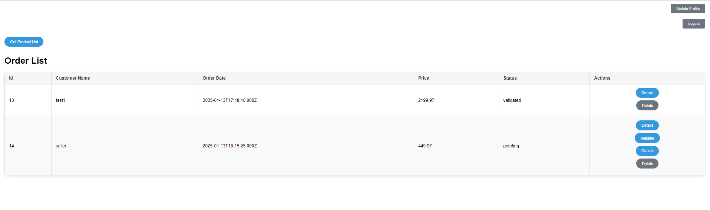
  - 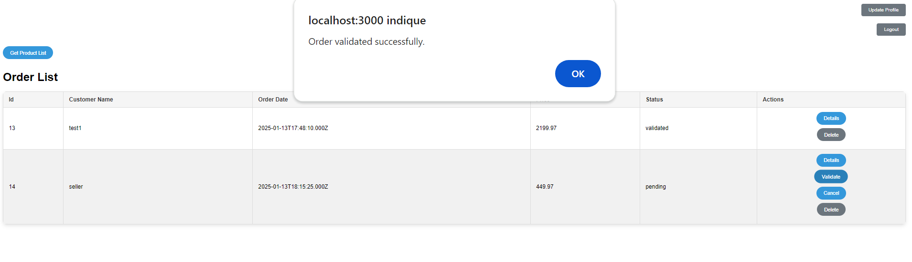

- **Modification des stocks** :
  L'administrateur peut modifier les stocks des produits directement depuis l'interface.
  - 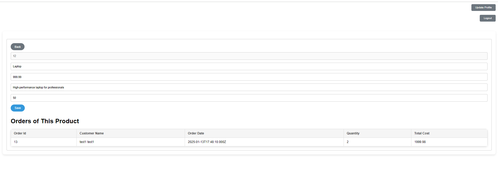

---

## Technologies utilisées

- **Frontend :**
  -HTML, CSS, JavaScript
  -React.js (frontend library)
  -Bootstrap (for basic CSS)

- **Backend :**
  - Node.js (Express.js)

- **Base de données :**
  - MySQL

---

